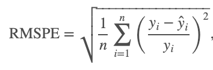

# DSR-Comp1
First Competition during the Data Science Retreat (9.-11.Oct 2019)

## Rossman Kaggle Mini-Competition

This mini competition is adapted from the Kaggle Rossman challenge. 

## Setup
To install the necessary packages, run:
``` 
pip install -r requirements.txt
```

To extract only the Training Data, run:
``` 
python data.py
```

To extract the Test Data (after the competition), run:
``` 
python data.py --test 1
```

## Data Set
The dataset is consists of two CSV-Files

store.csv:
``` 
Store - a unique ID for each store 
StoreType - differentiates between 4 different store models: a, b, c, d
Assortment - describes an assortment level: a = basic, b = extra, c = extended
CompetitionDistance - distance in meters to the nearest competitor store
CompetitionOpenSinceMonth - gives the approximate month of the time the nearest competitor was opened
CompetitionOpenSinceYear - gives the approximate year of the time the nearest competitor was opened
Promo2 - Promo2 is a continuing and consecutive promotion for some stores: 0 = store is not participating, 1 = store is participating
Promo2SinceWeek - describes the calendar week when the store started participating in Promo2
Promo2SinceYear - describes the year when the store started participating in Promo2
PromoInterval - describes the consecutive intervals Promo2 is started, naming the months the promotion is started anew. E.g. "Feb,May,Aug,Nov" means each round starts in February, May, August, November of any given year for that store
``` 

train.csv:
``` 
Store - a unique ID for each store
Date - date
DayOfWeek - Day of the week
Sales - the turnover for any given day (this is what you are predicting)
Customers - the number of customers on a given day
Open - an indicator for whether the store was open: 0 = closed, 1 = open
StateHoliday - indicates a state holiday. Normally all stores, with few exceptions, are closed on state holidays. Note that all schools are closed on public holidays and weekends. a = public holiday, b = Easter holiday, c = Christmas, 0 = None
SchoolHoliday - indicates if the (Store, Date) was affected by the closure of public schools
Promo - indicates whether a store is running a promo on that day
```

The test period is from 2014-08-01 to 2015-07-31 - the test dataset is the same format as train.csv.

## Task
The task is to predict the Sales of a given store on a given day.
Submissions are evaluated on the root mean square percentage error (RMSPE):



Zero sales days are ignored in scoring.

The team scores will be ranked - the highest score (lowest RMSPE) will receive a score of 10 for the scoring criteria section.

Each lower score (higher RMSPE) will receive a score of 10-(1 * number in ranking). If they are ranked second, score will be 10-2 = 8.

